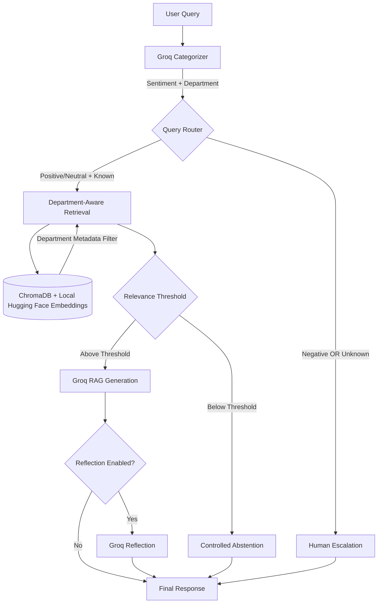

# ShopUNow Agentic AI Assistant

### Live Demo: https://shopunow-demo-assistant.streamlit.app

## Overview
ShopUNow Agentic AI Assistant is an intelligent, quota-efficient Retrieval-Augmented Generation (RAG) system built to serve both internal employees and external customers for a retail company. It routes queries to specific departmental knowledge bases (HR, IT Support, Billing & Payments, Shipping & Delivery) or escalates negative/unknown queries to human support agents.

This project was built as a capstone project focusing on Agentic RAG, LangGraph routing, strict LLM grounding, and deterministic evaluation, all while heavily optimizing for free-tier LLM API usage.

## System Architecture


The system uses a graph-based workflow powered by LangGraph:
1. **Categorization**: The user query is sent to a Groq LLM to determine the sentiment (Positive/Neutral/Negative) and the target Department.
2. **Conditional Routing**:
   - *Escalation*: If sentiment is Negative OR the department is Unknown, it routes to a Human Escalation node.
   - *RAG*: Otherwise, it routes to the Department-Aware RAG workflow.
3. **Department-Aware Retrieval**: Queries a local ChromaDB instance using local Hugging Face embeddings (`sentence-transformers/all-MiniLM-L6-v2`). The categorized department is applied as a metadata filter to prevent cross-department retrieval and knowledge leakage.
4. **Relevance Threshold & Controlled Abstention**: If retrieved documents do not meet the configured relevance threshold, the system skips LLM generation and returns a controlled abstention response to reduce hallucinations.
5. **Grounded Generation**: If relevant context is found, it uses Groq to generate a final answer *strictly* grounded in the retrieved documents.
6. **Reflection (Optional)**: Can be toggled on to re-verify the output against the context.

## Local Setup & Installation

### 1. Prerequisites
- Python 3.10+
- A Groq API Key

### 2. Environment Setup
Create a virtual environment and install the dependencies:
```bash
python -m venv venv
source venv/bin/activate  # On Windows use: venv\Scripts\activate
pip install -r requirements.txt
```

### 3. Configuration
Rename the provided environment template:
```bash
cp .env.example .env
```
Edit the `.env` file to include your API key:
```env
GROQ_API_KEY=your_groq_api_key_here
TOP_K=3
RELEVANCE_THRESHOLD=0.5
ENABLE_REFLECTION=False
```

### 4. Data Generation & Database Initialization
Since this project minimizes API usage, dataset generation and database initialization are done **once**.

Generate the synthetic QA dataset:
```bash
python data_generation.py
```
*(This will create a JSON file in the `data/` directory with 12 QA pairs per department).*

Initialize and populate the local ChromaDB vector database:
```bash
python database.py
```
*(This will embed the data using local Hugging Face models and persist it to `chroma_db/`).*

## Knowledge Base

The project uses a synthetic retail support dataset containing 48 QA records:

| Department | QA Records |
|---|---:|
| HR | 12 |
| IT Support | 12 |
| Billing & Payments | 12 |
| Shipping & Delivery | 12 |
| **Total** | **48** |

Each record includes department and audience metadata, enabling department-aware retrieval and preventing cross-department knowledge leakage.

## Running the Application

### Streamlit Web Interface
Run the conversational UI:
```bash
streamlit run ui.py
```
### Command Line Interface
Test the agent using the simple CLI:
```bash
python main.py --query "How do I apply for paid time off?"
```

### FastAPI Web Server
Run the FastAPI wrapper to expose a REST endpoint:
```bash
python app.py
```
Then send a POST request to `http://localhost:8000/query`:
```json
{
  "query": "My laptop screen is flickering."
}
```

## Running Evaluations
The project includes a deterministic evaluation suite that does not consume excessive LLM tokens. Run it to verify routing, abstention, and escalation behaviors:
```bash
python evaluation.py
```
**Current evaluation result: 5/5 tests passed.**

The evaluation validates:
- Department-aware retrieval
- Correct RAG responses
- Controlled abstention
- Negative-sentiment escalation
- Routing behavior


## Technology Stack

- **Python**
- **LangGraph** — agent workflow and conditional routing
- **LangChain** — LLM and RAG integration
- **Groq** — LLM inference
- **ChromaDB** — vector database
- **Hugging Face Sentence Transformers** — local embeddings
- **FastAPI** — REST API
- **Streamlit** — conversational web interface
- **Pydantic** — structured data validation
- **GitHub** — version control and deployment source
